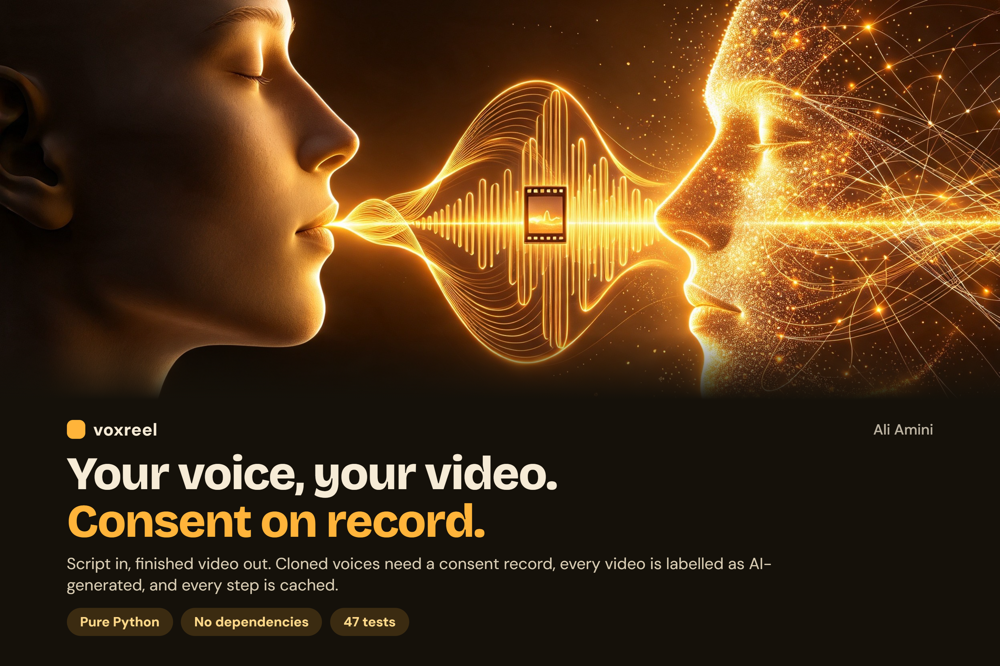

# voxreel

A consent-first pipeline for AI voice and AI-generated video. You describe scenes in one JSON file;
voxreel turns each scene into speech, a video clip and subtitles, and assembles one finished MP4.

* **Pure Python standard library.** The only external program is `ffmpeg`.
* **Bring your own models.** Providers are plug-ins: a local command (Coqui XTTS, Piper, a ComfyUI script…),
  any JSON/HTTP API (with async job polling), or the built-in offline `mock` provider.
* **Consent is enforced, not documented.** A cloned voice cannot render without a valid consent record.
* **Every output is labelled.** On-screen disclosure, MP4 metadata and a `.provenance.json` file.
* **Incremental.** Every step is cached by a hash of its inputs. Change one scene, only that scene re-renders.

## Quick start

```bash
python -m voxreel doctor              # checks ffmpeg and fonts
python -m voxreel init demo           # example project using the offline mock providers
python -m voxreel run demo            # -> demo/out/demo.mp4 + demo.provenance.json
python -m voxreel run demo            # second run: everything cached
```

The mock providers produce a tone and a coloured card so you can test the whole pipeline with no model,
no GPU and no account. Swap them for real providers in `project.json`.

## Project file

```json
{
  "title": "My video", "output": "out/video.mp4", "resolution": "1280x720", "fps": 24,
  "purpose": "narration", "voice": "narrator",
  "tts":   { "provider": "mock", "config": {} },
  "video": { "provider": "mock", "config": {} },
  "subtitles": "burn",
  "disclosure": { "label": true, "text": "AI-generated voice and video" },
  "scenes": [ { "id": "intro", "text": "Spoken text.", "visual": "Prompt for the video model" } ]
}
```

`subtitles`: `burn`, `sidecar` (an `.srt` next to the video) or `none`. A scene can override `voice`.

## Voices and consent

```bash
voxreel voice add-stock demo narrator                 # a provider's built-in voice: no consent needed

voxreel voice clone demo me \
  --sample my_voice.wav \
  --speaker "Jane Doe" \
  --statement "I, Jane Doe, agree to my voice being cloned for narration of my own videos." \
  --scope narration --expires 2027-12-31 \
  --recording consent_recording.wav \
  --confirm                                           # you attest the speaker agreed

voxreel voice list demo
voxreel voice revoke demo me --reason "speaker asked"   # takes effect on the next run
```

A cloned voice is refused, before any provider is called, when:

* there is no consent record, or the statement does not name the speaker;
* the consent was revoked or has expired;
* the project's `purpose` is not in the consent `scope`;
* the sample file changed since consent was recorded (it is pinned by SHA-256).

**What this is not:** voxreel cannot verify who is speaking in a sample or that your attestation is true.
It gives you a guard rail and an audit trail. Do not clone anyone's voice without their permission.

## Providers

### `command` — local models

Runs an argument list (never a shell string). Placeholders — TTS: `{text} {text_file} {voice} {sample} {out}`;
video: `{prompt} {duration} {width} {height} {fps} {out}`. See `examples/real-providers/local-models.json`.

### `http` — hosted APIs

```json
{ "url": "https://api.example.com/v1/speech",
  "headers": { "Authorization": "Bearer ${ENV:TTS_API_KEY}" },
  "body": { "text": "{text}", "voice": "{voice}" },
  "response": "binary" }
```

`response` is `binary`, `json_b64` or `json_url` (with `result_path`). For async video APIs add a `poll` block
(`job_path`, `url` with `{job_id}`, `status_path`, `done`, `failed`, `result_path`). Secrets come only from
environment variables (`${ENV:NAME}`), never from the project file, cache keys or provenance. Plain `http://`
is refused except for localhost. Text you synthesize cannot inject environment variables or placeholders.
See `examples/real-providers/hosted-api.json`; the endpoints there are placeholders.

### Your own voice with XTTS-v2 (local, open model)

`voxreel.tools.xtts` is a ready-made wrapper for [Coqui XTTS-v2](https://github.com/idiap/coqui-ai-TTS).
It speaks in a registered, consented voice using the sample you gave to `voxreel voice clone`.

```bash
python -m venv xtts-env                      # Python 3.10-3.12 is the safe choice for PyTorch
xtts-env\Scripts\activate                    # Windows  (Linux/macOS: source xtts-env/bin/activate)
pip install coqui-tts "transformers>=4.57,<5" "torch==2.8.0" "torchaudio==2.8.0"
```

(Tested on Windows with Python 3.12. Newer PyTorch needs `torchcodec` and FFmpeg DLLs for audio loading; pinning
torch/torchaudio 2.8.0 avoids that. transformers 5 removed a function the library imports.)

Then use `examples/real-providers/xtts.json`: put the path of that environment's `python` as the first item of
`cmd`, register your voice with `voxreel voice clone ... --confirm`, and run. The first run downloads the model
(about 2 GB); each scene loads it again, so expect it to be slow on CPU.

* Persian and other languages: XTTS-v2 does not speak them, but community fine-tunes do. `--hf-repo` / `--model-dir`
  load one (see `examples/real-providers/xtts-persian.json`, which uses `MohammadJRanjbar/ParsVoice-XTTS`; the repo is
  gated, so accept its terms on huggingface.co and run `hf auth login` first). Quality and licence are the model
  author's; read the model card. This path is provided as-is and has not been tested end to end by the
  voxreel author.
* Languages: en, es, fr, de, it, pt, pl, tr, ru, nl, cs, ar, zh-cn, ja, hu, ko, hi (no Persian).
* Samples in m4a/mp3/wav all work (ffmpeg converts them). A clean 6-30 second recording gives the best result.
* **Licence:** the XTTS-v2 weights are under the Coqui Public Model License, which is non-commercial.
  Read it before using the output for paid work, or write another provider around a model you may use commercially.

### Your own provider

```python
from voxreel.providers import TTSProvider, register_tts

@register_tts("mine")
class MyTTS(TTSProvider):
    def synthesize(self, text, voice, out_path):
        ...  # write audio to out_path
```

## Output

* `out/video.mp4` — H.264/AAC, loudness-normalised, with title and an AI-generated comment in the metadata.
* `out/video.provenance.json` — scene texts (hashed), voices, consent ids, providers, file hashes.
* `.voxreel/` — cache; safe to delete.

## Development

```bash
python -m unittest discover -s tests -t . -v      # 47 tests; ffmpeg is needed for the render tests
```

## Responsible use

Use voxreel only with voices you own or have permission to use, label synthetic media, and follow the
laws and platform rules that apply to you. The label and consent checks are defaults you can inspect and
extend, not a substitute for judgement.

## License

MIT
